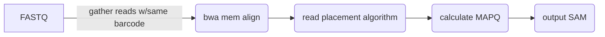

Arachne defaults to the EM algorithm from EMA, but provides the option `--rfa` to use the RFA algorithm from Lariat. This page
provides some background context about the two. Although Arachne is a fork of Lariat, both the EMA paper and our own benchmarks
show mild-to-moderately improved read placement with EM as compared to RFA, which is why EM is the default.

## Similarities
Before reading about the specific differences, it's worth pointing how how similar Lariat and EMA are. They both follow a very similar process:

They both:
1. map reads with the same barcode all at once
2. use bwa mem to map reads
3. do some kind of post-alignment placement assessment
4. output SAM alignments

These similarities actually made it quite natural to incorporate one algorithm as an option into the others' code.

## Lariat
Lariat was designed to align all reads sharing the same barcode simultaneously, assuming that those reads came from the
same molecule. Lariat is based on the original Random Field Aligner (RFA) method developed by the Batzoglou lab at Stanford: [Genome Res. 2015. 25:1570-1580](http://genome.cshlp.org/content/25/10/1570).

### The RFA
RFA takes all the read pairs from one barcode and decides which candidate "molecule" each ambiguous read belongs to.
It then picks the placements that make the molecules most coherent. For each barcode:

1. Each read pair is aligned and may have several candidate placements, for example one in each copy of a repeat. RFA keeps all of them.
It first marks the best-scoring pair of placements for each read as the starting guess.

2. Group the placements into candidate molecules. Placements on the same contig that fall within `--infer-distance` (default 50 kb) of each other are grouped,
since reads from one molecule should land near each other. A molecule that no read currently uses is dropped. 

3. Improve the assignment. RFA looks at one molecule at a time and asks: if the reads in this molecule that also have an alternative placement elsewhere moved there,
 would the whole picture get better? A move's score weighs:
- how well each read aligns at its old and new place (mismatches, indels, clipping)
- whether the pair stays properly paired (right orientation and spacing)
- penalties for creating or abandoning a well-supported molecule, because reads from one molecule should cluster and isolated single reads are unlikely

It takes the best-scoring move for that molecule and applies it only if it improves the score. It then moves on to the next molecule and cycles through them.

Compute confidence (MAPQ). For each read it works out how likely its placement is against the alternatives. It combines two estimates, and the lower one is used:
- estimate 1: the alignment scores, with penalties for sitting outside a well-supported molecule and a "none of these is right" pseudo-alternative
- estimate 2: the probability of moving the whole molecule's reads to a competing molecule

## EMA
EMA can be considered a different take on the idea posited by Lariat. For each barcode it asks, for every candidate placement of every read,
"how likely is it that the read really came from here?" It starts from a guess, then repeatedly refines that guess using what the other reads suggest.
For each barcode:
1. Each read pair is aligned and keeps all its candidate placements
2. Group placements into clouds. Placements on one contig that are within `--infer-distance` of each other form a "cloud", which stands in for a molecule. This is the same idea as RFA's candidate molecules.
3. Make a first guess. Each read gets a starting probability for each of its candidate placements, based only on how well it aligns there. Each cloud gets a weight equal to the expected number of reads in it.
4. Refine the guess 5 times. For each candidate placement, the new probability combines three things:
  - How well the read aligns there. This is EMA's scoring: each matching base, mismatch, indel and clipped base gets a fixed log probability, with the per-base mismatch rate set by `--em-error-rate`
  - How well supported the cloud is. Clouds that hold more reads are more plausible. A read's own contribution is left out, so it can't vote for its own cloud.
  - Whether the mate fits. The mate should land in the same cloud, on the opposite strand, at a sensible distance. The mate's evidence comes from its own score and cloud support, not from its already-updated posterior, which would otherwise be counted twice.

After each round the cloud weights are recomputed from the new probabilities, and the loop repeats. It stops early if nothing changes.
5. Pick the winner. Each read takes its most probable placement, and mates are linked.
6. Compute confidence (MAPQ). Each read's MAPQ comes from its winning probability, capped by a ceiling that depends on its own mismatches, indels and clipping. 
After that, RFA's molecule-level estimate (the probability that a whole molecule's reads move to a competing molecule) is computed for the chosen placement.
Each read's final MAPQ is the lower of the two. This keeps reads that sit in a contest between two molecules from getting a high MAPQ.
